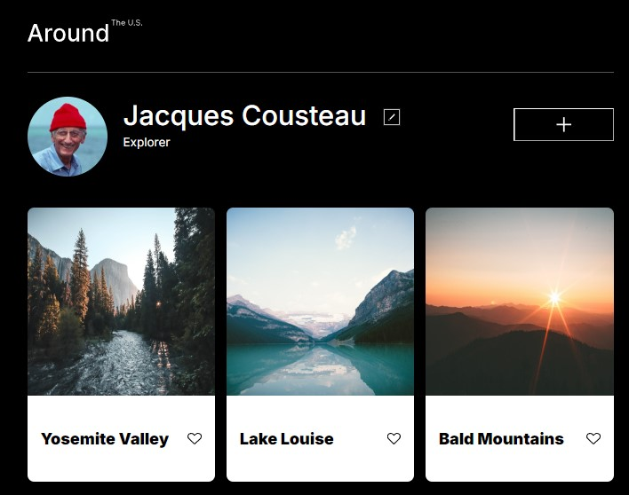

# Around the U.S.

This is the third project of the Software Engineering program at TripleTen. It was created using HTML and CSS, working from Figma design specifications for mobile and desktop layouts.

## Project features

- Grid Layout
- Flexbox
- Responsive Design
- Media Queries

## Links

[GitHub pages](https://lisaatea.github.io/se_project_aroundtheus/)

## Project updates

This page will be used in future projects, incorporating Javascript learnings to make it interactive.
