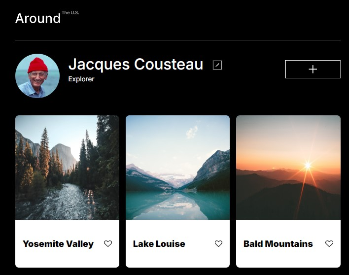

# Around the U.S.

This is the third project of the Software Engineering program at TripleTen. It was created using HTML, CSS, and Javascript, working from Figma design specifications for mobile and desktop layouts.

## Project features

- Grid Layout
- Flexbox
- Responsive Design
- Media Queries
- Responsive Modal
- Form Validation

## Links

[GitHub pages](https://lisaatea.github.io/se_project_aroundtheus/)

## Project updates

This page will be built upon in future projects, incorporating course learnings to increase functionality.
