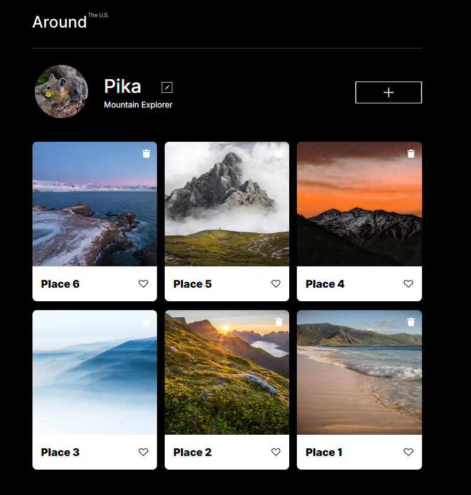
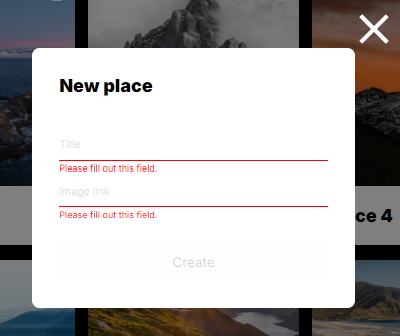

# Around the U.S.

## Project overview

This front-end development project was completed for the Software Engineering program at TripleTen. It was created following progressive lessons in HTML, CSS, and Javascript, working from Figma design specifications for mobile and desktop layouts.

## Key features

- Responsive Layout
- Interactive Modal Elements
- Data Validation
- API Intergration

## Technologies used

- HTML5
- CSS3 (including Grid Layout and Flexbox)
- JavaScript

## Gallery

## Links

[GitHub pages](https://lisaatea.github.io/se_project_aroundtheus/)
